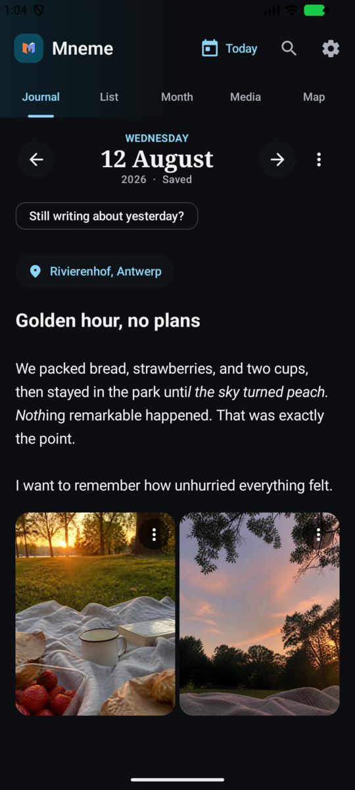
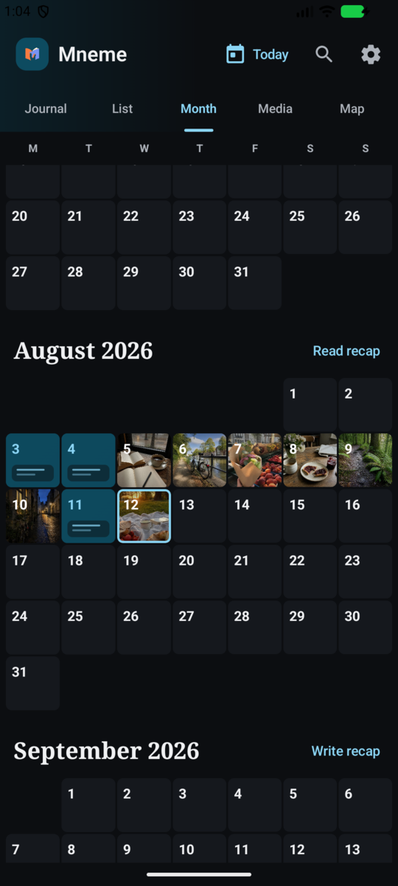
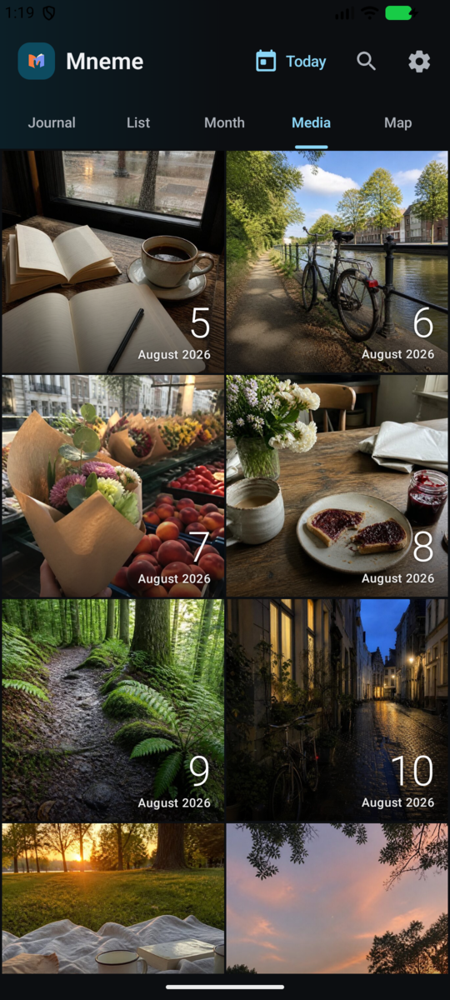
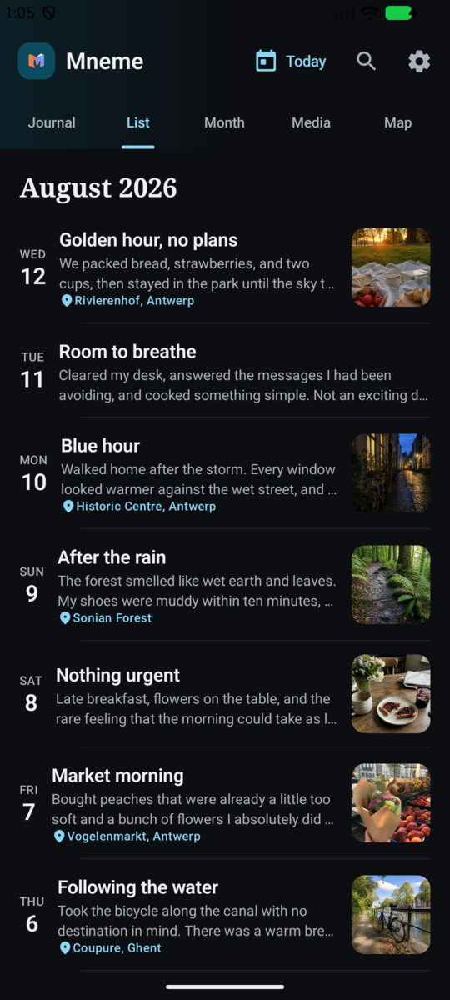
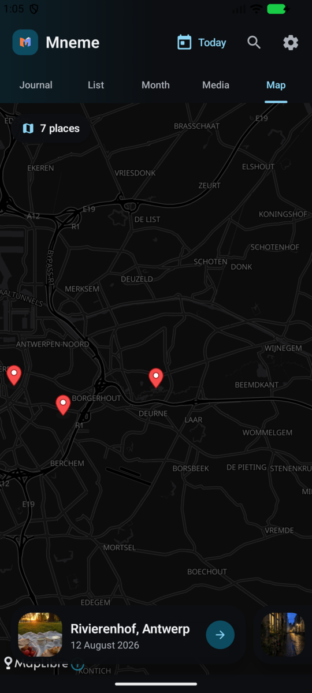
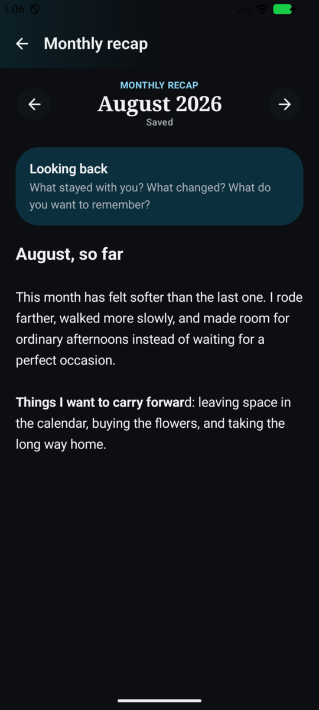
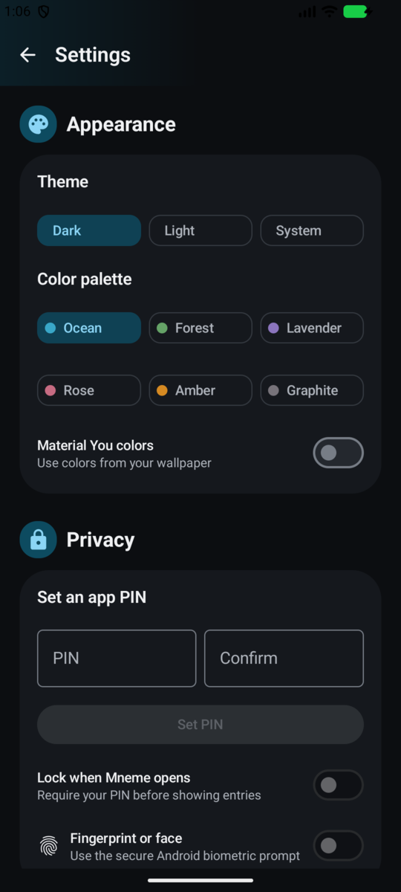

<p align="center">
  
</p>

<h1 align="center">Mneme</h1>

<p align="center">
  <strong>A private place for ordinary days.</strong><br>
  A native Android diary with rich writing, photos, places, monthly recaps,<br>
  and end-to-end encrypted backup to a server you control.
</p>

<p align="center">
  <a href="https://github.com/LainsMain/Mneme/actions/workflows/ci.yml"></a>
  <a href="https://github.com/LainsMain/Mneme/releases/latest"></a>
  <a href="https://hub.docker.com/r/egoisticfoil/mneme-server"></a>
  <a href="LICENSE"></a>
</p>

<p align="center">
  <a href="https://github.com/LainsMain/Mneme/releases/latest"><strong>Download the Android app</strong></a>
  ·
  <a href="#self-hosted-backup"><strong>Run the backup server</strong></a>
</p>

<p align="center">
  
  
  
</p>

Mneme is built for writing without ceremony. Open today, write as much or as
little as you want, add the photos that belong with the story, and leave. Every
day stays editable. If midnight passes while the day still feels unfinished,
Mneme offers a gentle shortcut back to yesterday instead of enforcing a rule.

There are no accounts, ads, analytics, or mandatory cloud services. Your diary
lives on your phone first. Backup is optional, self-hosted, and encrypted before
anything leaves the device.

## A diary that feels like yours

- **Writing, not markup.** Bold, italic, underline, headings, and strike-through
  appear directly in the editor. Mneme stores structured rich text, but never
  makes you work in a Markdown editor.
- **Photos belong to the page.** Add from the gallery or camera, arrange several
  photos in a compact mosaic, choose a primary image, and open any photo
  full-screen. Original files and EXIF/GPS metadata are preserved and visible.
- **Places with no map API key.** Mneme can infer a location from the primary
  photo, search with Android's built-in geocoder, or let you place a pin
  manually. The map uses MapLibre and keyless OpenFreeMap tiles.
- **Your own monthly recap.** Look back in your words instead of receiving an
  algorithmic summary of your life.
- **Made for the thumb.** Autosave, keyboard-aware scrolling, a compact floating
  formatting bar, and quick previous/next-day navigation keep the editor out of
  the way.

<table>
  <tr>
    <td width="33%" align="center"><br><sub><strong>List</strong> — writing, photos, and places at a glance</sub></td>
    <td width="33%" align="center"><br><sub><strong>Map</strong> — revisit entries by place</sub></td>
    <td width="33%" align="center"><br><sub><strong>Recap</strong> — remember the month in your own voice</sub></td>
  </tr>
</table>

## More ways back into a memory

The **List** view keeps complete days in a calm chronological stream. The
continuous **Month** view scrolls naturally through time, using photo previews
when a day has them and a clear writing mark when it does not. **Media** is one
unbroken, two-column wall sorted oldest to newest, with the day printed directly
on each image. **Search** finds words from the writing or the name of a place,
and **Map** groups entries around the places where they happened.

The Today action returns every timeline to the present without losing the date
you were editing.

## Private by design

<table>
  <tr>
    <td width="58%">
      <ul>
        <li>Local-first Room database and original photo files</li>
        <li>Optional app PIN with Android biometric unlock</li>
        <li>Immediate relock when Mneme leaves the foreground</li>
        <li>AES-256-GCM encryption before self-hosted backup</li>
        <li>Portable recovery code for restoring on a new phone</li>
        <li>Readable HTML, Markdown, photo, and metadata ZIP export</li>
        <li>No Google Maps key, account, analytics SDK, or ad SDK</li>
      </ul>
    </td>
    <td width="42%" align="center"><br><sub>Dark, light, system, six palettes, and Material You</sub></td>
  </tr>
</table>

The backup server receives opaque ciphertext, not readable diary entries. It
stores encrypted snapshots and content-addressed encrypted objects; even the
server token and server administrator cannot decrypt them without the recovery
code held by the app owner.

```text
Android phone  ── encrypts locally ──▶  your Mneme server  ──▶  opaque storage
                                      (Cloudflare Tunnel is optional)
```

## Install the Android app

Mneme supports Android 8.0 and newer.

1. Download the latest `Mneme-<version>.apk` from
   [GitHub Releases](https://github.com/LainsMain/Mneme/releases/latest).
2. Allow installation from your browser or file manager when Android asks.
3. Open Mneme. Everything works locally; connecting a server is optional.

Once installed, Mneme checks GitHub for releases when it opens. Updates download
through Android's Download Manager with visible progress, are verified against
the published SHA-256 digest, and then open Android's normal installer. A manual
**Check for updates** action is also available in Settings.

## Self-hosted backup

The production [Compose file](compose.yaml) runs the lightweight Go backup API
and persists its data in a named Docker volume. Download the two release assets
on any Docker host:

```bash
curl -LO https://github.com/LainsMain/Mneme/releases/latest/download/compose.yaml
curl -LO https://github.com/LainsMain/Mneme/releases/latest/download/mneme.env.example
cp mneme.env.example .env
docker compose up -d
docker compose exec mneme-server /mneme token create --name "My phone"
```

The final command prints the app token once; the server stores only its Argon2id
hash. Enter your server URL and that token under **Settings → Self-hosted
backup**, save the recovery code somewhere away from the phone, and make the
first backup.

Set `MNEME_LOCAL_PORT` in `.env` when port 8080 is already occupied. The included
optional Cloudflare Tunnel profile can publish the service without opening a
router port:

```bash
# Add CLOUDFLARE_TUNNEL_TOKEN to .env first.
docker compose --profile tunnel up -d
```

Mneme backs up shortly after diary changes when a network is available and has
a roughly six-hour periodic fallback. Android may defer work during Doze or
while offline. A fresh installation can connect to the same server and restore
the latest backup—or a selected retained snapshot—with the recovery code.

See [the deployment guide](deploy/README.md) for token management, an existing
Cloudflare Tunnel stack, updates, storage, and restore details.

## Build from source

### Android

Requirements: JDK 17 and an Android SDK containing API 36.

```bash
export ANDROID_HOME=/path/to/Android/Sdk
export JAVA_HOME=/path/to/jdk-17
./gradlew :android:app:testDebugUnitTest :android:app:assembleDebug
```

The debug APK is written to `android/app/build/outputs/apk/debug/`.

### Server

```bash
cd server
go test ./...
go run ./cmd/mneme token create --name "Development phone"
go run ./cmd/mneme serve
```

The API health endpoint is `http://localhost:8080/v1/health`. The API contract
lives in [api/openapi.yaml](api/openapi.yaml).

## Repository map

```text
android/       Native Kotlin + Jetpack Compose application
server/        Small Go encrypted-object backup service
api/           OpenAPI contract shared by app and server
deploy/        Local-development Compose stack and deployment guide
docs/          Real app screenshots and fictional documentation fixtures
compose.yaml   Release-ready production stack
```

The screenshot diary and its photos are fictional documentation fixtures, not
user data. Their provenance is documented in [docs/demo/README.md](docs/demo/README.md).

## Releases and security

A semantic version tag builds the signed APK, publishes matching
`egoisticfoil/mneme-server:<version>` and `latest` images, and creates a GitHub
release. The connected app also warns when its server is behind the current
compatible release. Maintainer instructions live in [RELEASING.md](RELEASING.md).

Do not post suspected vulnerabilities or exposed credentials in a public issue.
See [SECURITY.md](SECURITY.md) for private reporting and credential-handling
guidance. The repository uses secret scanning, push protection, and an
independent full-history scan in CI.

## License

Mneme is available under the [MIT License](LICENSE). Use it, change it, and make
it yours.
