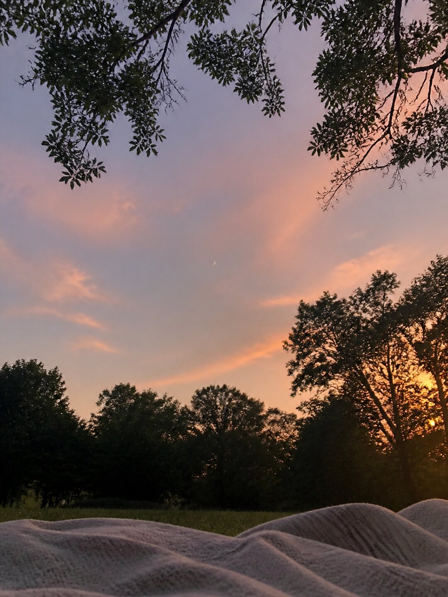
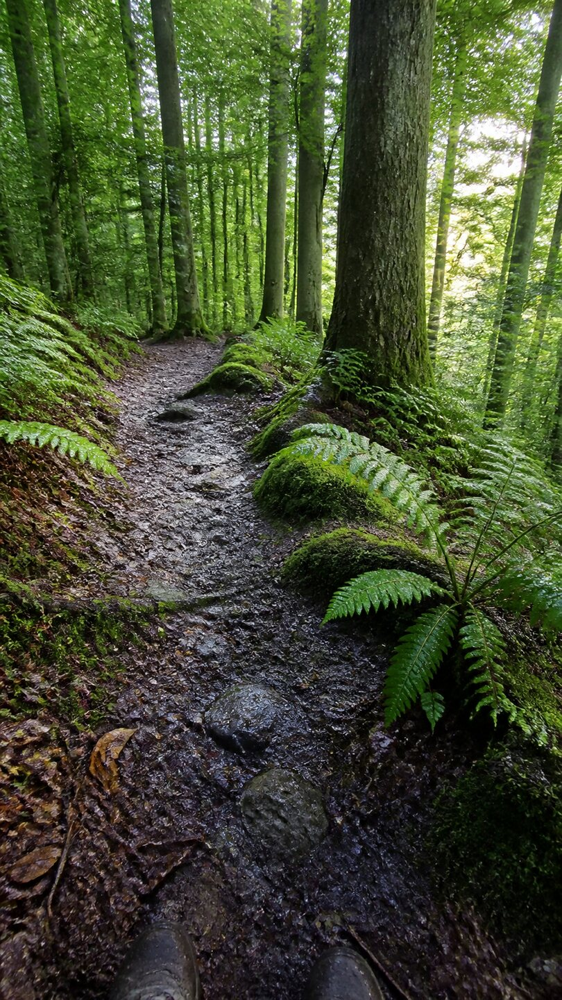
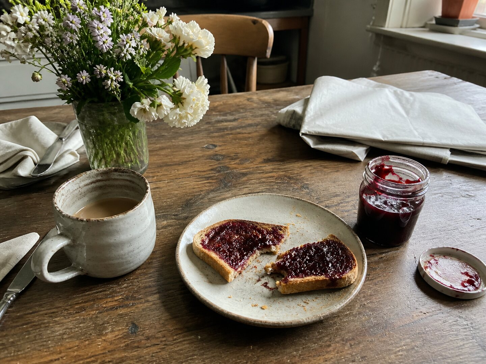

# Mneme documentation diary

This directory contains the fictional diary used in the repository screenshots.
It exists only to make the product documentation consistent and reproducible;
none of these files are bundled into the Android application or uploaded to a
Mneme backup server.

## Sample photos

<table>
  <tr>
    <td></td>
    <td></td>
    <td></td>
    <td></td>
  </tr>
  <tr>
    <td></td>
    <td></td>
    <td></td>
    <td></td>
  </tr>
</table>

The eight photographs were generated specifically for Mneme's documentation
with OpenAI's image generation tool. They depict invented moments, contain no
real user information, and were prompted to resemble imperfect everyday phone
photos rather than commercial stock photography.

`seed.sql` contains the matching fictional August 2026 diary: daily prose,
formatting marks, photo metadata, locations, and a monthly recap. It is a
developer-only screenshot fixture and is never executed by a production build.

## Updating the screenshots

Screenshots in `../screenshots/` are captures of the real Android application
running this fixture on an emulator. If a screen changes, update the relevant
capture along with the README so the repository never advertises a mock-up that
the app does not actually provide.
